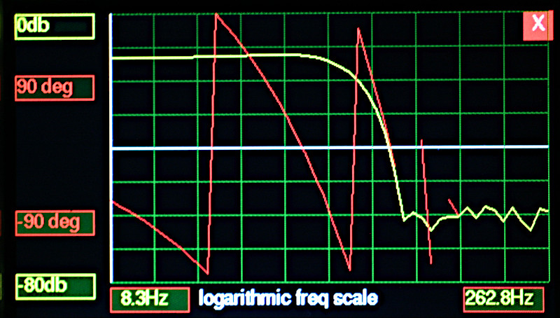
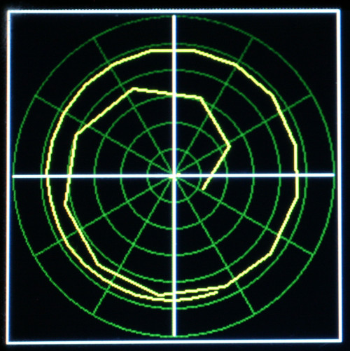

# Fast Filters for the Pyboard

V0.92 20th December 2021 Updated to improve portability.  
Author: Peter Hinch

# Introduction

This repository is intended for high speed filtering of integer data acquired
from transducers. For those unfamiliar with digital filtering, please see the
last section of this doc.

The repository comprises two sections.

## Realtime filtering

This handles a continuous stream of samples and conceptually works as follows
(pseudocode):
```python
filt = MyFilter(args)
while True:
    s = MyTransducer.get()  # Acquire an integer sample
    t = filt(s)  # Filter it
    # Use the filtered result
```
Support is provided for moving average and FIR (finite impulse response)
filtering. FIR filters may be defined using a web application to provide low
pass, high pass or bandpass characteristics.

The `fir.py` and `avg.py` modules use ARM Thumb V6 inline assembly language for
performance and can run on Pyboards (Thumb V7) and also the Raspberry Pico
(V6). The `fir_py.py` module is written in pure Python using the Viper emitter
for performance. It is therefore portable, but runs at about 33% of the speed
of the assembler version.

Filter functions may be called from hard ISR's.

The following images show Bode and Nyquist plots of measured results from a
Pyboard 1.1. The test signal was fed into a Pyboard ADC, with the resultant
signal on the DAC being plotted. -60dB is the noise floor of my home-brew
network analyser.

  

  

## Non-realtime filtering

This processes a set of samples in a buffer, for example processing sample sets
acquired by `ADC.read_timed()`. It requires the ARMV7 assembler and is
therefore restricted to Pyboard and similar targets. The files and docs are in
the `non_realtime` directory. See [the docs](./non_realtime/FILT.md).

The algorithm can be configured for continuous (circular buffer) or
discontinuous sample sets. It can optionally perform decimation. In addition to
FIR filtering it can be employed for related functions such as convolution,
cross- and auto-correlation.

The remainder of this README describes the realtime options.

# Designing the filter

The first stage in designing a filter is to determine the coefficients. FIR
filters can be designed for low pass, high pass, bandpass or band stop
applications and the site [TFilter](http://t-filter.engineerjs.com/) enables
these to be computed. I have provided a utility `coeff_format.py` to simplify
the conversion of coefficients into Python code. Use the website cited above
and set it to provide integer coefficients. Cut and paste the list of
coefficients into a file: this will have one integer per line. Then run:
```bash
python3 coeff_format.py inputfilename outputfilename.py
```
The result will be Python code defining the array.

## Coefficient order

The website cited above generates symmetrical (linear phase) sets of
coefficients. In other words, for a set of n coefficients,
`coeff[x] == coeff[n-x]`. For coefficient arrays lacking this symmetry note
that the code applies coefficients to samples such that the oldest sample is
multiplied by `coeff[0]` and so on with the newest getting `coeff[n]`.

## Scaling

Calculations are based on 32 bit signed arithmetic. Given that few transducers
offer more than 16 bit precision there is a lot of headroom. Nevertheless
overflow can occur depending on the coefficient size. The maximum output from
the multiplication is `max(data)*max(coeffs)` but the subsequent addition offers
further scope for overflow. In applications with analog output there is little
point in creating results with more precision than the output DAC. The `fir()`
function includes scaling by performing an arithmetic right shift on the result
of each multiplication. This can be in the range of 0-31 bits, although 20 bits
is a typical maximum.  
For an analytical way to determine the minimum scaling required to prevent
overflow see Appendix 1. The `lpf.py` example applies a scaling of 16 bits to
preserve the 12 bit resolution of the ADC which is then scaled in Python to
match the DAC.

## Solutions

Two MicroPython solutions are offered. The choice depends on the platform in
use. `fir_py.py` uses the Viper code emitter and should run on any platform.
`fir.py` uses inline Arm Thumb assembler and will run on hosts using ARM V6 or
later. This includes all Pyboards and boards using the Raspberry RP2 chip (e.g.
the Raspberry Pico). Using the Assembler version is slightly more inolved but
it runs about three times faster (on the order of 15μs).

## Portable FIR using Viper

The `fir_py` module uses a closure to enable the function to retain state
between calls. Usage is as follows:
```python
from fir_py import create_fir
from array import array
# 21 tap LPF. Figures from TFilter.
coeffs = array('i', (-1318, -3829, -4009, -717, 3359, 2177, -3706, -5613,
                    4154, 20372, 28471, 20372, 4154, -5613, -3706, 2177,
                    3359, -717, -4009, -3829, -1318))
fir = create_fir(coeffs, 0)  # Instantiate fir function. No scaling.

print(fir(1))
for n in range(len(coeffs)+3):
    print(fir(0))
```
This example simulates an impulse function passing through the filter. The
outcome simply replays the coefficients followed by zeros once the impulse has
cleared the filter.

The `create_fir` function takes the following mandatory positional args:
 1. `coeffs` A 32 bit integer array of coefficients.
 2. `shift` The result of each multiplication is shifted right by `shift` bits
 before adding to the result. See Scaling above.

Note that Viper can issue very confusing error messages. If these occur, check
the data types passed to `create_fir` and `fir`.

## FIR using ARM Thumb Assembler

In addition to the coefficient array the Assembler version requires the user to
pass an array to hold the set of samples

The `fir.fir()` function takes three arguments:
 1. An integer array of length equal to the number of coeffcients + 3.
 2. An integer array of coefficients.
 3. The new data value.
 
The function returns an integer which is the current filtered value.  
The array must be initialised as follows:
 1. `data[0]` should be set to len(data).
 2. `data[1]` is a scaling value in range 0..31: see scaling above.
 3. Other elements of the data array must be zero.

Usage is along these lines:
```python
from fir import fir
from array import array
# 21 tap LPF. Figures from TFilter.
coeffs = array('i', (-1318, -3829, -4009, -717, 3359, 2177, -3706, -5613,
                    4154, 20372, 28471, 20372, 4154, -5613, -3706, 2177,
                    3359, -717, -4009, -3829, -1318))
ncoeffs = len(coeffs)
data = array('i', (0 for _ in range(ncoeffs + 3)))
data[0] = ncoeffs
data[1] = 0  # No scaling

print(fir(data, coeffs, 1))
for n in range(ncoeffs + 3):
    print(fir(data, coeffs, 0))
```
This example simulates an impulse function passing through the filter. The
outcome simply replays the coefficients followed by zeros once the impulse has
cleared the filter.

## Demo program

The file `lpf.py` uses a Pyboard as a low pass filter with a cutoff of 40Hz. It
processes an analog input presented on pin X7, filters it, and outputs the
result on DAC2 (X6). For convenience the code includes a swept frequency
oscillator with output on DAC1 (X5). By linking X5 and X7 the filtered result
can be viewed on X6.

The filter uses Timer 4 to sample the incoming data at 2KHz.
The program generates a swept frequency sine wave on DAC1 and reads it using
the ADC on pin X7. The filtered signal is output on DAC2. The incoming signal
is sampled at 2KHz by means of Timer 4, with the FIR filter operating in the
timer's callback handler.

When using the oscillator to test filters you may see occasional transients
occurring in the stopband. These are a consequence of transient frequency
components caused by the step changes in the oscillator frequency: this can be
demonstrated by increasing the delay between frequency changes. Ideally the
oscillator would issue a slow, continuous sweep.

firtest.py illustrates the FIR operation and computes execution times with
different sets of coefficients.

## Performance

These results were measured on a Pyboard 1.1 running firmware V1.17. Times are
in μs and were measured using `firtest.py` (adapted to run the Viper version).
The accuracy of these timings is suspect as they varied between runs - and it
makes no sense for the 41 tap filter to run faster than the 21 tap. However
they give an indication of performance.

| Taps | Asm | Viper |
|:----:|:---:|:-----:|
| 21   | 18  |  33   |
| 41   |  9  |  32   |
| 109  | 30  |  93   |

# Moving average

A moving average is a degenerate case of an FIR filter with unity coefficients.
As such it can run faster. On the Pyboard 1.1 the moving average takes about
8μs for a typical set of coefficients.

The Raspberry Pico ARM V6 assembler doesn't support integer division. A special
version `avg_pico.py` runs on the Pico. This offers scaling using a right shift
operation which produces correct resullts if the number of entries is a power
of 2. Alternatively with a scaling factor of 0 the result is `N*average` where
`N` is the number of entries.

On Pyboards and other ARMV7 targets, the file `avg.py` produces expected values
for all `N`. Both versions provide a function `avg`.

## Moving Average Usage

The `avg` function takes two arguments, or three in the Pico case:
 1. An integer array of length equal to the no. of entries to average +3.
 2. The new data value.
 3. The scaling value (number of bits to shift right) - Pico only.

The function returns an integer which is the current filtered value.  
Initially all elements of the data array must be zero, except `data[0]` which
should be set to `len(data)`  
The test scripts `avgtest.py` and `avgtest_pico.py` illustrate its operation.
```python
from avg_pico import avg
```

# Absolute Beginners

Data arriving from transducers often needs to be filtered to render it useful.
Reasons include reducing noise (random perturbations) in the data, isolating a
particular signal or shaping the response to sudden changes in the data value.
A common approach to reducing noise is to take a moving average of the last N
samples. While this is computationally simple and hence fast, it is a
relatively crude form of filtering because the oldest sample in the set has the
same weight as the most recent. This is often non-optimal.

FIR (finite impulse response) filters can be viewed as an extension of the
moving average concept where each sample is allocated a different weight
depending on its age. These weights are defined by a set of coefficients. The
result is calculated by multiplying each sample by its coefficient before
adding them; a moving average corresponds to the situation where all
coefficients are set to 1. By adjusting the coefficients you can alter the
relative weights of the data values, with the most recent having a different
weight to the next most recent, and so on.

In practice FIR filters can be designed to produce a range of filter types:
low pass, high pass, bandpass, band stop and so on. They can also be tailored
to produce a specific response to sudden changes (impulse response). The
process of computing the coefficients is complex, but the link above provides a
simple GUI approach. Set the application to produce 16 or 32 bit integer
values, set your desired characteristics and press "Design Filter". Then
proceed as suggested above to convert the results to Python code.

The term "finite impulse response" describes the response of a filter to a
brief (one sample) pulse. In an FIR filter with N coefficients the response
drops to zero after N samples because the impulse has passed through the
filter. This contrasts with an IIR (infinite impulse response) filter where the
response theoretically continues forever. Analog circuits such as a CR network
can have an IIR response, as do some digital filters.

# Appendix 1 Determining scaling

The following calculation determines the number of bits required to represent
the outcome when a worst-case signal passes through an FIR filter. The ADC is
assumed to be biassed for symmetrical output. The worst-case signal, at some
amount of shift through the filter, has maximum positive excursion matching
positive coefficients and maximum negative excursion matching negative
coefficients. This will produce the largest possible positive sum. By symmetry
a negative result of equal magnitude could result, where a negative signal
matches a positive coefficient and vice-versa.

There are two places where overflow can occur: in the multiplication and in the
subsequent addition. The former cannot be compensated: the coefficients need to
be reduced in size. The latter can be compensated by performing a right shift
after the multiplication, and the Assembler routine provides for this.

The following code calculates the number of bits required to accommodate this
result. On 32-bit platforms, small integers occupy 31 bits holding values up to
+-2^30. Consequently if this script indicates that 33 bits are required,
scaling of at least 2 bits must be applied to guarantee no overflow.

```python
from math import log

# Return no. of bits to contain a positive integer
def nbits(n : int) -> int:
    return int(log(n) // log(2)) + 1

def get_shift(coeffs : list, adcbits : int =12):
    # Assume ADC is biassed for equal + and - excursions
    maxadc = (2 ** (adcbits - 1) - 1)  # 2047 for 12 bit ADC
    lv = sorted([abs(x) * maxadc for x in coeffs], reverse=True)
    # Add 1 to allow for equal negative swing
    print("Max no. of bits for multiply", nbits(lv[0]) + 1)
    print("Max no. of bits for sum of products", nbits(sum(lv) + 1))
```


