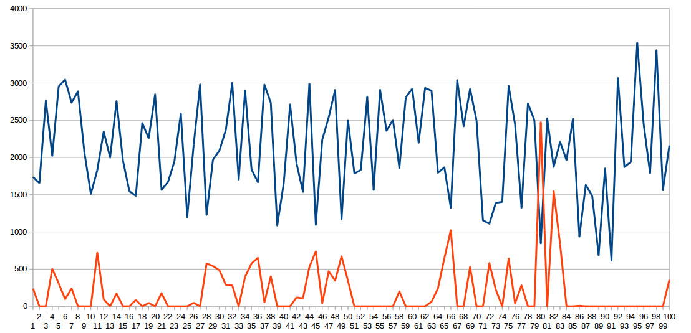

# 1. Fast filtering of sample arrays

A function `dcf` is provided which performs discrete convolution on an array of
samples acquired from an ADC. This enables the implementation of finite impulse
response (FIR) filters with characteristics including high pass, low pass, band
pass and band stop. It achieves millisecond and sub-ms level performance on
platforms using STM chips (for example the Pyboard). To achieve this it uses
the MicroPython inline assembler for the ARM Thumb instruction set. It uses the
hardware floating point unit.

It can also be used for techniques such as correlation to detect signals in the
presence of noise.

Section 2 describes the underlying principles with section 3 providing the
details of the function's usage.

## 1.1 Files

 * `filt.py` Module providing the `dcf` function.
 * `filt_test.py` Test/demo of FIR filtering.
 * `coeffs.py` Coefficients for the above.
 * `correlate.py` Test/demo of correlation.
 * `correlate.jpg` Image of data from which a signal can be detected.

The test programs use simulated data and run on import. See code comments for
documentation.

# 2. Filtering Sample Arrays

One application of the `dcf` function is to perform FIR filtering on an array
of input samples acquired from an ADC. An array of coefficients determines the
filter characteristics. If there are `N` samples and `P` coefficients, the most
recent `P` samples are each multiplied by its corresponding coefficient. The
summation of the results becomes the most recent element in the output array.
This process is repeated for successively earlier initial samples. See
[Wikipedia](https://en.wikipedia.org/wiki/Finite_impulse_response).

Mathematically this process is similar to convolution, cross-correlation and
auto-correlation and the function may be employed for those purposes. In
particular correlation may be used to detect an expected signal in the presence
of noise.

## 2.1 Aliasing and Decimation

In any sampled data system the maximum frequency which may be accurately
represented is given by `Fmax = Fs/2` where `Fs` is the sampling rate. `Fmax`
is known as the Nyquist rate. If analog signals with a higher frequency are
present at the ADC input, these will be 'aliased', appearing as signals below
the Nyquist rate. A low pass analog filter should be used prior to the ADC to
limit the amplitide of aliased signals.

In some applications a signal is initially sampled at a high rate before being
filtered and down-sampled to the intended rate. Such a filter is known as a
decimation filter. The anti-aliasing filter comprises a relatively simple
analog filter with further low pass filtering being performed in the digital
domain. The `dcf` function provides optional decimation. See
[Wikipedia](https://en.wikipedia.org/wiki/Decimation_(signal_processing)).

## 2.2 Bias removal

Typically the analog signal has a DC bias to ensure that all samples lie within
range of the ADC. In most applications the DC bias should be removed prior
to processing so that signals are symmetrical about 0.0. Usually this is done
by subracting the calculated value of the DC bias (e.g. 2048 for a 12 bit ADC
biassed at its mid point). In cases where the DC bias is not known at design
time it may be derived from the mean of the sample set. The function provides
for both cases.

The function also provides for cases where bias removal is inappropriate - in
particular filters whose aim is to perform a measurement of the DC level in the
presence of noise.

## 2.3 Circular or Linear Convolution

The analog signal being sampled can be considered to be continuous or
discontinuous. An example of a continuous signal is where the waveform being
studied has a known frequency, and the sample rate has been chosen to sample an
integer number of cycles. Another example is a study of acoustic background
noise: though the signal isn't formally repetitive it may be valid to process
it as if it were. In these cases `dcf` can be configured to treat the input
buffer as a circular buffer; an array of `N` samples will produce `N` results.

A sample array considered to be non-repetitive will not process the oldest
samples: an array of `N` samples processed with `P` coefficients will produce
`N-P` results. In the non-repetitive case processing of the oldest samples
cannot be performed: this occurs once the number of outstanding samples is less
than the number of coefficients.

## 2.4 Design of FIR filters

FIR filters can be designed for low pass, high pass, bandpass or band stop
applications and the site [TFilter](http://t-filter.engineerjs.com/) enables
the coefficients to be computed. For `dcf` select the `double` option to
make it produce floating point results. The C/C++ option is easy to convert to
Python.

# 3. Function dcf

This performs an FIR filtering operation (discrete convolution) on an integer
array of input samples and an array of floating point coefficients. Results
are placed in an array of floats, with an option to copy back to the integer
(half word) source array. All arrays are in time order with the earliest
entry in element 0.

If the number of samples is `N` and a decimation factor `D` is applied, the
number of result elements is `N // D`.

Results are "left justified" in the result array, with the oldest result in
element 0. In cases where there are fewer result values than input samples,
this allows the result array to be smaller than the sample array, saving RAM.

The function does not allocate memory.

Args:  
 `r0` The input sample array. An array of half words.  
 `r1` The result array. An array of floats. In the normal case where the
 decimation factor is 1 this should be the same length as the sample array. If
 decimating by N its length must be >= (no. of samples)/N.  
 `r2` Coefficients. An array of floats.  
 `r3` Setup: an integer array of 5 elements.

`Setup[0]` Length of the sample array.  
`Setup[1]` Length of the coefficient array. Must be < length of sample array.  
`Setup[2]` Flags (bits controlling algorithm behaviour). See below.  
`Setup[3]` Decimation factor. For no decimation set to 1.  
`Setup[4]` Offset. DC offset of input samples. Typically 2048. If -1 the
average value of the samples is calculated and assumed to be the offset.

Return value:
`n_results` The number of result values. This depends on `wrap` and the
decimation value. Valid data occupy result array elements 0 to `n_results -1`.
Any subsequent output array elements will retain their original contents.

Flags:  
`b0` Wrap. See section 3.1.1.  
`b1` Scale. If set, scale all results by a factor. If used, the (float) scale
factor must be placed in element 0 of the result array. All results are
multiplied by this factor. Scaling is a convenience feature: the same result
may be achieved by muliplying all the coefficients by the factor.  
`b2` Reverse. Determines whether coefficients are applied in time order or
reverse time order. If the coefficients are viewed as a time sequence (as in
correlation or convolution), by default they are applied with the most recent
sample being matched with the most recent coefficient. So correlation is
performed in the default (forward) order. If using coefficients from
[TFilter](http://t-filter.engineerjs.com/) for FIR filtering the order is
immaterial as these arrays are symmetrical (linear phase filters). For
convolution the reverse order should be selected.  
`b3` Copy. Determines whether results are copied back to the sample array. If
this is selected the results are converted to integers and the DC bias is
restored. If decimation is selected elements 0 to `N // D` will be populated.
Remaining samples will be set to the mean (DC bias) level.

Constants `WRAP`, `SCALE`, `REVERSE` and `COPY` are provided enabling the flags
to be set by the logical `or` of the chosen constants. Typical setup code is as
below (`bufin` is the sample array, `coeffs` the coefficients and `op` is the
output array):

```python
setup = array('i', (0 for _ in range(5)))
setup[0] = len(bufin)  # Number of samples
setup[1] = len(coeffs)  # Number of coefficients
setup[2] = SCALE | WRAP | COPY
setup[3] = 1 # Decimation factor
setup[4] = -1 # Calculate the offset from the mean
op[0] = 1.1737  # Scaling factor in result array[0]
```

The result array is in time order with the oldest result in `result[0]`. If the
result array is longer than required, elements after the newest result will not
be altered. If `wrap` is `False` the fist (oldest) elements will be 0 (see
3.1.1).

## 3.1 Algorithm

For users unfamiliar with the maths the basic algorithm is illustrated by this
Python code. The input, output and coefficient arrays are args `ip`, `op`,
`coeffs`. Circular processing is controlled by `wrap` and `dc` contains the DC
bias (2048 for a 12 bit ADC). This illustration is much simplified and does not
include decimation. Coefficient processing is only in normal order; it does not
left justify the results.

```python
def filt(ip, op, coeffs, scale, wrap, dc=2048):
    iplen = len(ip)  # array of input samples
    last = -1 if wrap else len(coeffs) - 2
    for idx in range(iplen -1, last, -1): # most recent first
        res = 0.0
        cidx = idx
        for x in range(len(coeffs) -1, -1, -1):  # Array of coeffs (float)
            res += (ip[cidx] - dc) * coeff[idx] * scale  # end of array first
            cidx -= 1
            cidx %= iplen  # Circular processing
        op[idx] = res  # Float o/p array
    for idx, entry in enumerate(op):  # Copy back to i/p array, restore DC
        ip[idx] = int(entry) + dc
```

The first sample in the sample array is presumed to be the oldest. The filter
algorithm starts with the newest sample with the result going into the last
element of the result array: time ordering is preserved. If there are `N`
coefficients, the current sample and `N-1` predecessors are each multiplied by
the matching coefficient, with the result being the sum of these products. This
result is multiplied by the scaling factor and placed in the result array, in
the position matching the original sample.

In the above example and in `dcf` (in normal order) coefficients are applied in
time order. Thus if the coefficient array contains `n` elements numbered from 0
to n-1, when processing `sample[x]`, `result[x]` is  
`sample[x]*coeff[n -1] + sample[x-1]*coeff[n-2] + sample[x-2]*coeff[n-3]...`  

In the Python code DC bias is subtracted from each sample before processing -
`dcf` uses `Setup[4]` to control this behaviour.

Results in the output array do not have any DC bias restored - in other words
they are referenced to zero.

### 3.1.1 Wrap

Where `wrap` is `True` the outcome is an output array where each element
corresponds to an element in the input array.

Assume there are `P` coefficients. If `wrap` is `False`, as the algorithm steps
back to earlier samples, a point arises when there are fewer than `P` samples.
In this case it is not possible to calculate a vaild result and the output
element is set to 0. `N` samples processed with `P` coefficients will produce
`N-P+1` results. Subsequent elements of the result array will be unchanged.

See [section 2.3](./FILT.md#23-circular-or-linear-convolution) for a discussion
of this from an application perspective.

### 3.1.2 Decimation

In normal processing `Setup[3]` should be 1. If it is set to a value `D` where
`D > 1` only `N//D` output samples will be produced. These will be placed in
elements 0 upwards of the output array. Subsequent elements of the result array
will be unchanged.

Decimation saves processing time and RAM (in that a smaller output array may be
used).

### 3.1.3 Copy

If `Setup[2]` has the `copy` bit set results are copied back to the original
sample array: to do this the DC bias is restored and the result converted to a
16-bit integer. The bias value used is that employed in the filter computation:
either a specified value or a measured mean.

If decimation is selected such that `Q` results are computed, the first `Q`
entries in the sample array will contain valid data. Subsequent elements will
be set to the DC bias value.

See [section 2.1 Aliasing and decimation](./FILT.md#21-aliasing-and-decimation)
for a discussion of this.

### 3.1.3 Performance

On a Pyboard V1.1 a convolution of 128 samples with 41 coefficients, computing
the mean, using wrap and copying all samples back, took 912μs. This compares
with 128ms for a MicroPython version using the standard code emitter. While
the time is dependent on the number of coefficients it will be reduced if a
fixed offset and/or no wrap is used.

A correlation of 1000 samples with a 50 coefficient signal takes 7.6ms.

It is worth noting that there are faster convolution algorithms. The "brute
force and ignorance" approach used here has the merit of being simple to code
in Assembler with the drawback of O(N^2) performance. Algorithms with
O(N.log N) performance exist, at some cost in code complexity. Typical
microcontroller applications may have anything up to a few thousand samples but
few coefficients. This contrasts with statistical applications where both
sample sets may be very large.

## 3.2 Correlation test

The graph below shows a 100 sample snapshot of the simulated datastream which
includes the target signal. This can reliably be identified by `correlate.py`
with precise timing. Not easy visually :)


